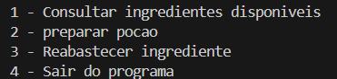
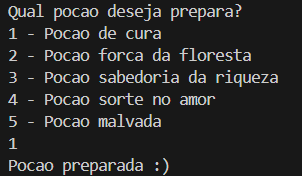
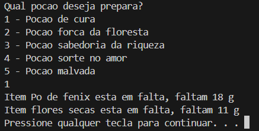
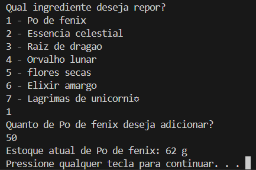

# Laboratório de Alquimia

## Índice
- <a href="#-Objetivo-do-projéto">Objetivo do projéto</a>
- <a href="#-Como-utilizar">Como utilizar</a>
- <a href="#-Futuras-atualizações">Futuras atualizações</a>
- <a href="#-Participantes-do-projéto">Participantes do projéto</a>

## Objetivo do projéto

Este projéto foi criado para aprimorar o gerenciamento de estoque e produção em laboratórios de alquimia. Ele oferece funcionalidades que permitem a verificação de disponibilidade de insumos para a produção de poções e apresentar o estoque atual de forma organizada e eficiente

Com foco na automação e na precisão, o sistema visa otimizar os processos internos dos laboratórios, reduzindo erros manuais, prevenindo faltas de insumos e garantindo maior controle sobre os recursos disponíveis. Essa abordagem contribui para melhorar a produtividade e o planejamento estratégico, essencial para atender às demandas do laboratório de forma ágil e confiável.

## Como utilizar
Primeiramente o programa apresenta um menu inicial, no qual é possivel escolher qual processo seguir no programa.

### 1 - Consultar ingredientes disponiveis

Nesta primeira opção é possivel visualizar a quantidade atual do estoque disponivel.

- Exemplo de saida:

### 2- Preparar poção
Aqui é possivel verificar se há insumos necessarios para a produção.

- Exemplo de quando há todos os ingredientes em estoque:
  

- Exemplo de falta em estoque:
  

### 3 - Reabastercer ingredientes

Para reabastercer ingredientes é bem simples, como toda a ultilização do programa, Após esolher a opção tres do menu (reabastecer ingredientes), aparecera outro menu contendo os ingredientes cadastrados.

- Exemplo de siada:
  

